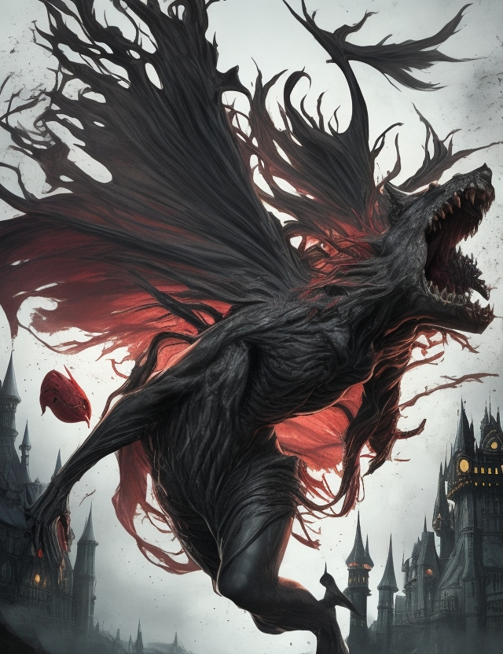
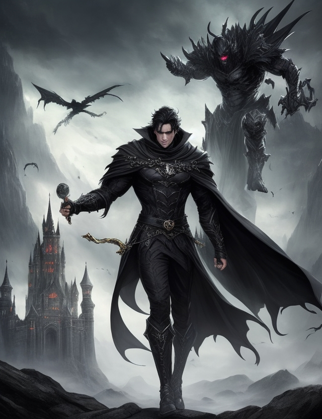
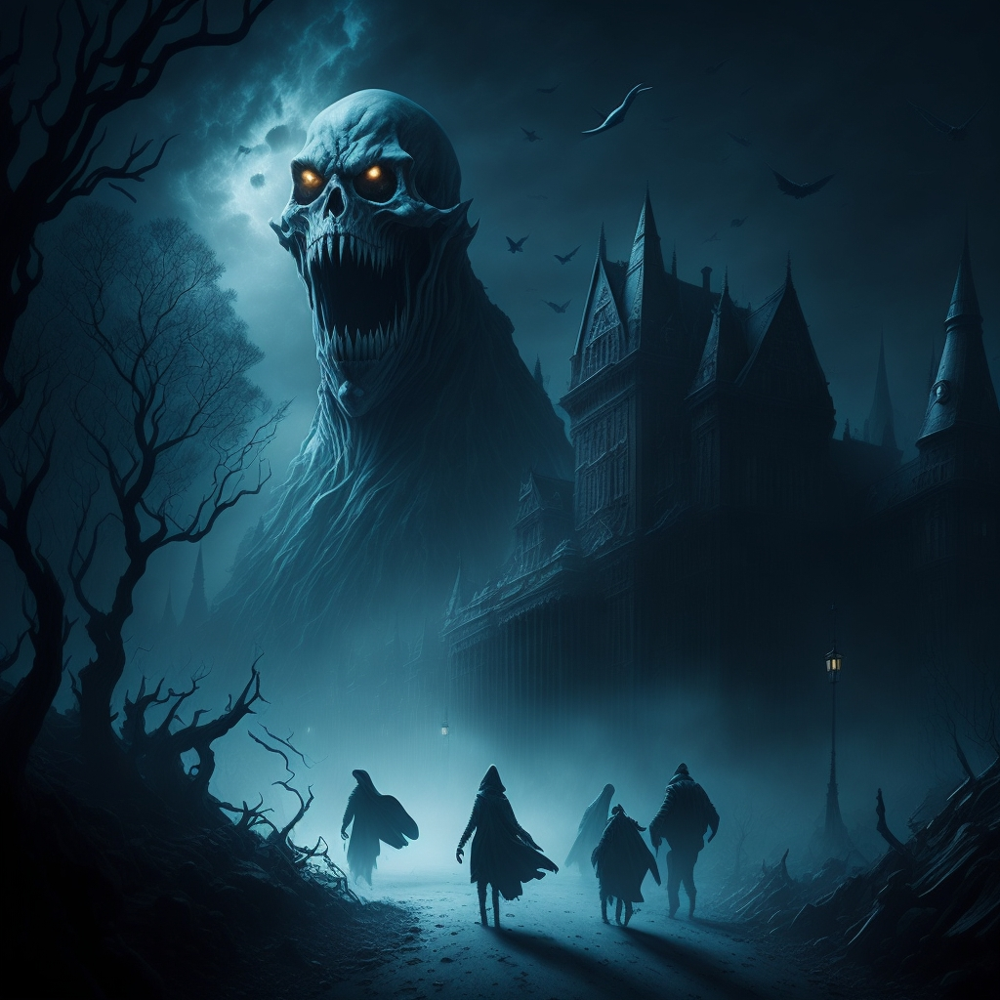

# AI Odyssey Lab

Welcome to AI Odyssey Lab, the gateway to a world where machines breathe life into imagination. Dive headfirst into the enigmatic realm of artificial intelligence, where mysteries wait to be unraveled, creativity knows no bounds, and innovation becomes an art form. Our digital voyage promises to spark your curiosity, ignite your imagination, and redefine your perception of what's possible. Join us as we embark on a quest to explore the limitless horizons of AI, where the journey is as thrilling as the destination.

## Table of Contents
- [Home](#home)
- [Image Gallery](#image-gallery)
- [Dark Stories](#dark-stories)
- [Contact](#contact)
- [License](#license)

---

## Home

### Introduction

Welcome to AI Odyssey Lab, where the magic of artificial intelligence comes to life, conjuring captivating visuals and chilling tales that spark wonder and curiosity. Are you ready to embark on this mesmerizing journey?

### Background Sound and Video

- **Background Sound:** Listen to eerie soundscapes that set the mood for your adventure.
  - [Play Audio](IMG/horror.mp3)
  - [Play Audio](IMG/ghostWishper.mp3)
  - [Play Audio](IMG/creepy.mp3)

- **Video:** Immerse yourself in captivating AI-generated video content.
  - [Watch Video](IMG/clone.mp4)

### Main Content

- **AI-Generated Images:** Explore a collection of AI-generated images that push the boundaries of creativity.
  - [View Images](Image.html)

- **Dark Stories Library:** Dive into chilling narratives crafted by artificial intelligence.
  - [Read Stories](Story.html)

---

## Image Gallery

### Introduction

Welcome to our AI-Generated Image Gallery, where the lines between imagination and reality blur into a mesmerizing tapestry of artistry. Each image is a testament to the boundless creative possibilities of AI, painting vivid landscapes of fantasy, dark realms, and awe-inspiring beauty.

### Gallery

#### The Nightmare Lurk

- In the moon's pale light, a grotesque, tentacled monstrosity emerges from the depths of a shadowy abyss, its many eyes fixated on its prey.
- [Download The Nightmare Lurk](IMG/img1.jpg)

#### The Haunted Asylum

- Within the decaying walls of an asylum, the spirits of tormented souls take on sinister forms, their ghoulish laughter echoing through the corridors.
- [Download The Haunted Asylum](IMG/img2.jpg)

#### The Infernal Portal

- A gateway to hell opens in a forgotten mausoleum, releasing a horde of demonic entities into the mortal realm, their presence heralded by a fiery maelstrom.
- [Download The Infernal Portal](IMG/img3.jpg)

#### The Labyrinth of Minotaurs

- Deep within an ancient labyrinth, hulking minotaurs with horns and bloodied axes await lost wanderers, their roars echoing through winding passages.
- [Download The Labyrinth of Minotaurs](IMG/img4.jpg)

#### The Fiery Demon Lord

- Within a realm of eternal flames, a demon lord of molten rock and searing fury emerges, ready to unleash devastation upon the world.
- [Download The Fiery Demon Lord](IMG/img5.jpg)

#### Undead Pharaoh's Curse

- A long-forgotten tomb reveals an undead pharaoh, adorned in ancient regalia, and a legion of mummified servants, awakened to seek vengeance.
- [Download Undead Pharaoh's Curse](IMG/img6.jpg)

---

## Dark Stories

### Introduction

Welcome to the Dark Stories Library, where mysteries lurk in every shadow and chilling tales blur the line between reality and the supernatural. Brace yourself for a journey into the heart of fear and fascination as you step into this eerie realm, where AI-driven narratives blur the boundaries between the known and the mysterious.

### Story 1 - The Sorcerer's Circle: Dark Magic and Curses

In the dark and eerie forest, a cloaked figure stands amidst a sea of flickering candles. The mysterious figure, clad in black, seems to be the center of attention, as the candles are placed in a circle around him. The surrounding trees and the darkness of the forest create an ominous atmosphere, hinting at a sinister presence.

As the story unfolds, the cloaked figure is revealed to be a powerful sorcerer, summoned by a group of desperate villagers to help them fend off an ancient curse that has been plaguing their town. The curse has been causing unexplained disappearances and unsettling events, and the villagers believe that only a powerful sorcerer can put an end to it.

[Read Story](Story.html#story-1---the-sorcerers-circle-dark-magic-and-curses)

### Story 2 - The Guardian of the Haunted Castle

In the dark and eerie forest, a group of travelers stumbled upon a haunted castle, shrouded in mist and surrounded by gnarled trees. As they approached the castle, they noticed a massive, grotesque creature looming over them, its eyes glowing with an unnatural light. The travelers, frightened by the sight, tried to run away, but the creature's roar echoed through the forest, causing them to freeze in fear.

As they stood there, paralyzed by fear, the creature began to move towards them, its massive form casting an ominous shadow over the group. The travelers realized that they were trapped, and their only hope was to find a way to escape the creature's grasp.

[Read Story](Story.html#story-2---the-guardian-of-the-haunted-castle)

---

## Contact

If you have any questions, feedback, or inquiries, feel free to contact us at [contact@aiodysseylab.com](mailto:contact@aiodysseylab.com). We value your input and are eager to hear from you.

## License

&copy; 2023 AI Odyssey Lab. All rights reserved.

Thank you for exploring AI Odyssey Lab with us!
